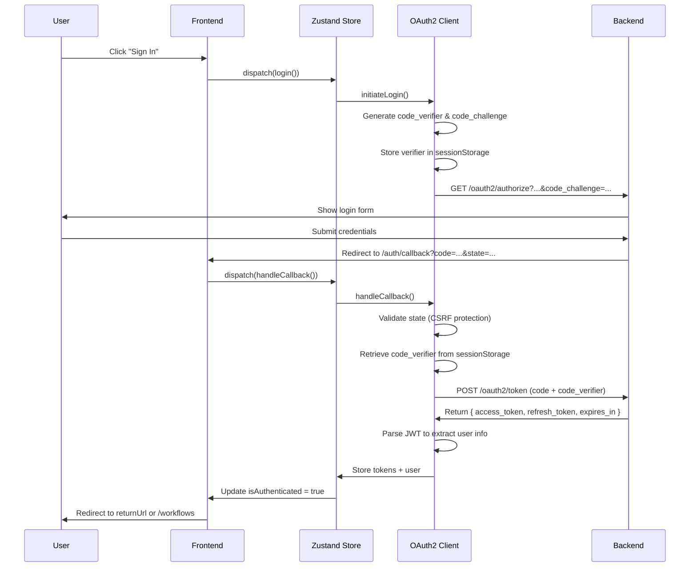
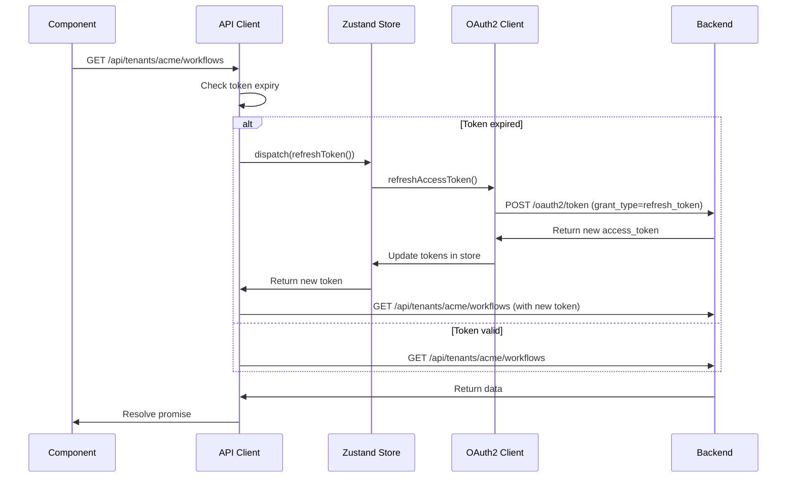

# Frontend IAM Implementation Design

**Status**: Draft
**Last Updated**: 2025-11-10
**Author**: Engineering Team
**Related Docs**: [Web Frontend IAM Integration Guide](../guide/web-frontend-iam-integration.md)

---

## Table of Contents

1. [Executive Summary](#executive-summary)
2. [Requirements](#requirements)
3. [Architecture Design](#architecture-design)
4. [Implementation Plan](#implementation-plan)
5. [File Structure](#file-structure)
6. [Component Specifications](#component-specifications)
7. [State Management](#state-management)
8. [API Integration](#api-integration)
9. [Security Considerations](#security-considerations)
10. [Testing Strategy](#testing-strategy)
11. [Migration Strategy](#migration-strategy)
12. [Success Metrics](#success-metrics)

---

## Executive Summary

This document outlines the design and implementation strategy for integrating Identity and Access Management (IAM) into the Flovyn frontend application. The implementation will use OAuth2 Authorization Code Flow with PKCE, Zustand for state management, and TanStack Query for API integration.

### Key Goals

- Implement secure OAuth2 authentication with PKCE
- Support SSO (Google/GitHub)
- Enable multi-tenant access control
- Provide seamless token refresh mechanism
- Integrate with existing Next.js 15 App Router architecture

### Tech Stack

- **Framework**: Next.js 15 (App Router)
- **State Management**: Zustand 5.0.8 (already installed)
- **API Client**: TanStack Query v5
- **Auth Protocol**: OAuth2 + PKCE
- **Token Storage**: sessionStorage + Zustand

---

## Requirements

### Functional Requirements

#### FR1: Authentication
- FR1.1: Users can sign in with email/password via OAuth2
- FR1.2: Users can sign in with Google SSO
- FR1.3: Users can sign in with GitHub SSO
- FR1.4: Users can sign out and revoke tokens
- FR1.5: System automatically refreshes expired access tokens
- FR1.6: Users remain authenticated across browser sessions (until token expiry)

#### FR2: Multi-Tenant Access
- FR2.1: Users can belong to multiple tenants
- FR2.2: Users can switch between tenants via URL routing
- FR2.3: All API calls are tenant-scoped
- FR2.4: Users can create new tenants
- FR2.5: System validates user has access to requested tenant

#### FR3: Authorization
- FR3.1: System enforces role-based access control (RBAC)
- FR3.2: UI adapts based on user role (OWNER, ADMIN, MEMBER)
- FR3.3: Protected routes redirect unauthenticated users to login
- FR3.4: System shows appropriate error for unauthorized access (403)

#### FR4: Space Management
- FR4.1: Users can create spaces within tenants
- FR4.2: Users can manage space members and permissions
- FR4.3: Space operations respect user permissions

#### FR5: User Management
- FR5.1: Admins can invite users to tenants
- FR5.2: Admins can assign tenant and space roles
- FR5.3: Admins can remove users from tenants
- FR5.4: Users can view their profile and tenant memberships

#### FR6: Worker Management
- FR6.1: Admins can create worker credentials
- FR6.2: System displays client secret only once during creation
- FR6.3: Admins can list and revoke worker credentials

### Non-Functional Requirements

#### NFR1: Security
- NFR1.1: No client secret stored (public client)
- NFR1.2: PKCE prevents authorization code interception
- NFR1.3: State parameter prevents CSRF attacks
- NFR1.4: Tokens stored securely (sessionStorage, not localStorage)
- NFR1.5: All API requests include Bearer token
- NFR1.6: No tokens logged to console or exposed in URLs

#### NFR2: Performance
- NFR2.1: Authentication check completes within 200ms
- NFR2.2: Token refresh happens transparently without UX disruption
- NFR2.3: API client retries failed requests after token refresh
- NFR2.4: JWT parsed locally (no additional API call for user info)

#### NFR3: User Experience
- NFR3.1: Loading states shown during auth operations
- NFR3.2: Clear error messages for auth failures
- NFR3.3: Smooth transitions between authenticated/unauthenticated states
- NFR3.4: Return URL preserved across login flow

#### NFR4: Maintainability
- NFR4.1: Type-safe with TypeScript
- NFR4.2: Centralized auth logic (no duplication)
- NFR4.3: Clear separation of concerns
- NFR4.4: Comprehensive documentation

---

## Architecture Design

### High-Level Architecture

```
┌─────────────────────────────────────────────────────────────┐
│                     Next.js App (flovyn-app)                 │
│                                                              │
│  ┌────────────────────────────────────────────────────┐    │
│  │  Presentation Layer                                 │    │
│  │  - Pages (auth/login, auth/callback, tenants/[slug])│    │
│  │  - Components (ProtectedRoute, TenantSwitcher)     │    │
│  │  - Hooks (useAuth, useUser, useTenants)            │    │
│  └────────────────┬───────────────────────────────────┘    │
│                   │                                          │
│  ┌────────────────▼───────────────────────────────────┐    │
│  │  State Management Layer (Zustand)                   │    │
│  │  - Auth Store (user, tokens, loading states)        │    │
│  │  - Actions (login, logout, refreshToken)            │    │
│  └────────────────┬───────────────────────────────────┘    │
│                   │                                          │
│  ┌────────────────▼───────────────────────────────────┐    │
│  │  API Client Layer                                   │    │
│  │  - OAuth2 Client (PKCE, token exchange)            │    │
│  │  - Authenticated API Client (auto-refresh)          │    │
│  │  - TanStack Query Hooks (data fetching)            │    │
│  └────────────────┬───────────────────────────────────┘    │
│                   │                                          │
└───────────────────┼──────────────────────────────────────────┘
                    │
                    │ HTTPS
                    ▼
┌─────────────────────────────────────────────────────────────┐
│                  Flovyn Backend (Spring Boot)                │
│  - Spring Authorization Server (OAuth2/OIDC)                 │
│  - REST APIs (tenant-scoped)                                 │
│  - gRPC Services (for workers)                               │
└─────────────────────────────────────────────────────────────┘
```

### Component Diagram

```
┌─────────────────────────────────────────────────────────────┐
│                        apps/web/                             │
│                                                              │
│  ┌──────────────────────────────────────────────────────┐  │
│  │ app/                                                  │  │
│  │  ├── auth/                                            │  │
│  │  │   ├── login/page.tsx         [Auth UI]           │  │
│  │  │   └── callback/page.tsx      [OAuth Handler]     │  │
│  │  ├── tenants/                                         │  │
│  │  │   └── [slug]/                [Tenant Routes]      │  │
│  │  │       ├── workflows/                              │  │
│  │  │       ├── spaces/                                 │  │
│  │  │       ├── members/                                │  │
│  │  │       └── settings/                               │  │
│  │  └── layout.tsx                 [Auth Provider]      │  │
│  └──────────────────────────────────────────────────────┘  │
│                                                              │
│  ┌──────────────────────────────────────────────────────┐  │
│  │ lib/                                                  │  │
│  │  ├── auth/                                            │  │
│  │  │   ├── client.ts              [OAuth2 + PKCE]     │  │
│  │  │   ├── store.ts               [Zustand Store]     │  │
│  │  │   ├── hooks.ts               [React Hooks]       │  │
│  │  │   └── types.ts               [Type Definitions]  │  │
│  │  ├── api/                                             │  │
│  │  │   ├── client.ts              [API Client]        │  │
│  │  │   ├── queries.ts             [TanStack Hooks]    │  │
│  │  │   └── types.ts               [API Types]         │  │
│  │  └── types/                                           │  │
│  │      └── index.ts               [Shared Types]       │  │
│  └──────────────────────────────────────────────────────┘  │
│                                                              │
│  ┌──────────────────────────────────────────────────────┐  │
│  │ components/                                           │  │
│  │  ├── auth/                                            │  │
│  │  │   ├── protected-route.tsx    [Route Guard]       │  │
│  │  │   ├── login-button.tsx       [Login UI]          │  │
│  │  │   └── logout-button.tsx      [Logout UI]         │  │
│  │  ├── tenants/                                         │  │
│  │  │   ├── tenant-switcher.tsx    [Tenant Selector]   │  │
│  │  │   └── tenant-settings.tsx    [Settings UI]       │  │
│  │  ├── spaces/                                          │  │
│  │  │   ├── space-list.tsx         [Space Management]  │  │
│  │  │   └── space-form.tsx         [CRUD UI]           │  │
│  │  ├── members/                                         │  │
│  │  │   ├── member-list.tsx        [User Management]   │  │
│  │  │   └── invite-form.tsx        [Invitation UI]     │  │
│  │  └── workers/                                         │  │
│  │      ├── worker-list.tsx        [Credential Mgmt]   │  │
│  │      └── worker-form.tsx        [Creation UI]       │  │
│  └──────────────────────────────────────────────────────┘  │
└─────────────────────────────────────────────────────────────┘
```

### Authentication Flow Sequence



### Token Refresh Flow



---

## Implementation Plan

### Phase 1: Foundation (Week 1)

**Goal**: Set up core authentication infrastructure

#### 1.1: Environment & Dependencies
- [ ] Add environment variables to `.env.local`
- [ ] Install TanStack Query: `pnpm add @tanstack/react-query @tanstack/react-query-devtools`
- [ ] Install jose for JWT parsing: `pnpm add jose`
- [ ] Create auth type definitions

#### 1.2: OAuth2 Client
- [ ] Implement `flovyn-app/lib/auth/client.ts` with PKCE
  - PKCE utilities (code_verifier, code_challenge)
  - Authorization URL generation
  - Token exchange
  - Token refresh
  - JWT parsing
- [ ] Write unit tests for crypto functions

#### 1.3: Auth Store
- [ ] Implement `flovyn-app/lib/auth/store.ts` with Zustand
  - State: `{ isAuthenticated, isLoading, user, error }`
  - Actions: `login`, `logout`, `handleCallback`, `refreshToken`, `checkAuth`
  - Persist logic with sessionStorage
- [ ] Add devtools for debugging

#### 1.4: Auth Hooks
- [ ] Implement `flovyn-app/lib/auth/hooks.ts`
  - `useAuth()` - Main auth hook
  - `useUser()` - Current user
  - `useTenants()` - User's tenants
  - `useIsAdmin()` - Check admin role
  - `useRequireAuth()` - Auto-redirect if not authenticated

**Deliverables**: Core auth infrastructure ready for integration

---

### Phase 2: API Integration (Week 2)

**Goal**: Integrate authentication with API layer

#### 2.1: API Client
- [ ] Implement `flovyn-app/lib/api/client.ts`
  - HTTP client with automatic Bearer token injection
  - Token refresh on 401 responses
  - Request retry logic
  - Tenant-scoped URL handling
  - Error normalization

#### 2.2: TanStack Query Setup
- [ ] Create QueryClient configuration
- [ ] Implement query hooks in `flovyn-app/lib/api/queries.ts`:
  - `useWorkflows(tenantSlug)`
  - `useWorkflow(workflowId, tenantSlug)`
  - `useCreateWorkflow(tenantSlug)`
  - `useTenants()`
  - `useSpaces(tenantSlug)`
  - `useMembers(tenantSlug)`
  - `useWorkers(tenantSlug)`
- [ ] Add QueryClientProvider to root layout

#### 2.3: Mock to Real API Migration
- [ ] Replace mock client with authenticated client
- [ ] Update existing components to use new API hooks
- [ ] Handle tenant slug in URLs

**Deliverables**: API client with auth integration

---

### Phase 3: Authentication UI (Week 2-3)

**Goal**: Implement authentication user interface

#### 3.1: Login Page
- [ ] Create `flovyn-app/app/auth/login/page.tsx`
  - Email/password form (triggers OAuth2 flow)
  - Google SSO button
  - GitHub SSO button
  - Error display
  - Loading states

#### 3.2: OAuth Callback
- [ ] Create `flovyn-app/app/auth/callback/page.tsx`
  - Handle OAuth2 callback
  - Display loading state
  - Error handling
  - Redirect to returnUrl

#### 3.3: Protected Routes
- [ ] Create `flovyn-app/components/auth/protected-route.tsx`
  - Check authentication status
  - Show loading spinner
  - Redirect to login if unauthenticated
- [ ] Wrap existing routes with ProtectedRoute

#### 3.4: Auth UI Components
- [ ] Create `flovyn-app/components/auth/login-button.tsx`
- [ ] Create `flovyn-app/components/auth/logout-button.tsx`
- [ ] Update Navigation component with auth status

**Deliverables**: Complete authentication UI

---

### Phase 4: Multi-Tenant Features (Week 3)

**Goal**: Implement tenant-scoped routing and management

#### 4.1: Tenant Routing
- [ ] Migrate routes to tenant-scoped structure:
  - `/tenants/[slug]/workflows`
  - `/tenants/[slug]/runs`
  - `/tenants/[slug]/spaces`
  - `/tenants/[slug]/members`
  - `/tenants/[slug]/settings`
- [ ] Create tenant layout component
- [ ] Add tenant validation middleware

#### 4.2: Tenant Switcher
- [ ] Create `flovyn-app/components/tenants/tenant-switcher.tsx`
  - Dropdown with user's tenants
  - Current tenant indicator
  - Create new tenant option
- [ ] Add to Navigation/Header

#### 4.3: Tenant Management
- [ ] Create tenant creation form
- [ ] Create tenant settings page
- [ ] Implement tenant CRUD operations

**Deliverables**: Multi-tenant routing and UI

---

### Phase 5: Space & User Management (Week 4)

**Goal**: Implement space and user management features

#### 5.1: Space Management
- [ ] Create `flovyn-app/components/spaces/space-list.tsx`
- [ ] Create `flovyn-app/components/spaces/space-form.tsx`
- [ ] Implement space CRUD operations
- [ ] Add space member management

#### 5.2: User Management
- [ ] Create `flovyn-app/components/members/member-list.tsx`
- [ ] Create `flovyn-app/components/members/invite-form.tsx`
- [ ] Implement user invitation flow
- [ ] Add role assignment UI
- [ ] Implement user removal

#### 5.3: Worker Management
- [ ] Create `flovyn-app/components/workers/worker-list.tsx`
- [ ] Create `flovyn-app/components/workers/worker-form.tsx`
- [ ] Implement credential creation with secret display
- [ ] Add warning modal for one-time secret display
- [ ] Implement credential revocation

**Deliverables**: Complete IAM feature set

---

### Phase 6: Security & Polish (Week 5)

**Goal**: Harden security and improve UX

#### 6.1: Security Hardening
- [ ] Audit token storage implementation
- [ ] Verify CSRF protection
- [ ] Add Content Security Policy
- [ ] Implement rate limiting UI feedback
- [ ] Add input validation for all forms

#### 6.2: Error Handling
- [ ] Implement global error boundary
- [ ] Add error toast notifications
- [ ] Improve error messages
- [ ] Add retry mechanisms

#### 6.3: UX Improvements
- [ ] Add loading skeletons
- [ ] Improve transition animations
- [ ] Add success notifications
- [ ] Implement optimistic updates

#### 6.4: Testing
- [ ] Unit tests for auth client
- [ ] Unit tests for auth store
- [ ] Integration tests for auth flows
- [ ] E2E tests for login/logout
- [ ] E2E tests for tenant switching

**Deliverables**: Production-ready implementation

---

## File Structure

### Complete File Tree

```
apps/web/
├── .env.local                      # Environment variables
├── package.json                    # Add @tanstack/react-query, jose
├── lib/
│   ├── auth/
│   │   ├── client.ts               # OAuth2 client with PKCE
│   │   ├── store.ts                # Zustand auth store
│   │   ├── hooks.ts                # React hooks
│   │   └── types.ts                # Auth type definitions
│   ├── api/
│   │   ├── client.ts               # Authenticated API client
│   │   ├── queries.ts              # TanStack Query hooks
│   │   └── types.ts                # API response types
│   └── types/
│       └── index.ts                # Shared type definitions
├── app/
│   ├── layout.tsx                  # Add QueryClientProvider + AuthProvider
│   ├── auth/
│   │   ├── login/
│   │   │   └── page.tsx            # Login page
│   │   └── callback/
│   │       └── page.tsx            # OAuth callback handler
│   ├── tenants/
│   │   └── [slug]/
│   │       ├── layout.tsx          # Tenant layout
│   │       ├── workflows/
│   │       │   ├── page.tsx        # Workflows list
│   │       │   └── [id]/page.tsx   # Workflow detail
│   │       ├── runs/
│   │       │   ├── page.tsx        # Runs list
│   │       │   └── [id]/page.tsx   # Run detail
│   │       ├── spaces/
│   │       │   ├── page.tsx        # Spaces list
│   │       │   └── [id]/page.tsx   # Space detail
│   │       ├── members/
│   │       │   └── page.tsx        # Members management
│   │       ├── workers/
│   │       │   └── page.tsx        # Workers management
│   │       └── settings/
│   │           └── page.tsx        # Tenant settings
│   └── page.tsx                    # Landing page (redirect to login or tenant)
├── components/
│   ├── auth/
│   │   ├── protected-route.tsx     # Route guard component
│   │   ├── login-button.tsx        # Login button
│   │   ├── logout-button.tsx       # Logout button
│   │   └── auth-provider.tsx       # Auth context provider
│   ├── tenants/
│   │   ├── tenant-switcher.tsx     # Tenant selector dropdown
│   │   ├── tenant-form.tsx         # Tenant creation form
│   │   └── tenant-settings.tsx     # Tenant settings UI
│   ├── spaces/
│   │   ├── space-list.tsx          # Space list view
│   │   ├── space-form.tsx          # Space CRUD form
│   │   └── space-member-list.tsx   # Space members
│   ├── members/
│   │   ├── member-list.tsx         # Member list view
│   │   ├── invite-form.tsx         # User invitation form
│   │   └── role-badge.tsx          # Role display badge
│   └── workers/
│       ├── worker-list.tsx         # Worker list view
│       ├── worker-form.tsx         # Worker creation form
│       └── secret-modal.tsx        # One-time secret display
└── middleware.ts                   # (Optional) Auth middleware
```

---

## Component Specifications

### 1. OAuth2 Client (`flovyn-app/lib/auth/client.ts`)

**Purpose**: Handle OAuth2 Authorization Code Flow with PKCE

**Public API**:
```typescript
class OAuth2Client {
  // Initiate login flow
  initiateLogin(options?: { returnUrl?: string }): Promise<void>

  // Handle OAuth callback
  handleCallback(): Promise<{ tokens: TokenResponse; state: string }>

  // Exchange authorization code for tokens
  exchangeCodeForTokens(code: string, codeVerifier: string): Promise<TokenResponse>

  // Refresh access token
  refreshAccessToken(refreshToken: string): Promise<TokenResponse>

  // Revoke tokens
  revokeToken(token: string): Promise<void>

  // SSO methods
  loginWithGoogle(): void
  loginWithGitHub(): void

  // Utilities
  parseJWT(token: string): JWTClaims
  isTokenExpired(token: string): boolean
  scheduleTokenRefresh(callback: () => void): void
}
```

**Key Implementation Details**:
- PKCE code_verifier: 32-byte random string, base64url-encoded
- PKCE code_challenge: SHA-256 hash of verifier
- State parameter: Random UUID for CSRF protection
- Store verifier and state in sessionStorage during flow
- Parse JWT locally (no /userinfo call needed)

---

### 2. Auth Store (`flovyn-app/lib/auth/store.ts`)

**Purpose**: Zustand store for auth state management

**State Shape**:
```typescript
interface AuthState {
  // State
  isAuthenticated: boolean
  isLoading: boolean
  user: JWTClaims | null
  error: string | null

  // Actions
  login: (returnUrl?: string) => Promise<void>
  logout: () => Promise<void>
  handleCallback: () => Promise<void>
  refreshToken: () => Promise<TokenResponse>
  checkAuth: () => void
  setError: (error: string | null) => void
  clearError: () => void
}
```

**Persistence**:
- Tokens stored in sessionStorage
- On app load: check sessionStorage for tokens
- If tokens exist: validate expiry and set user state
- Schedule automatic token refresh before expiry

---

### 3. Auth Hooks (`flovyn-app/lib/auth/hooks.ts`)

**Hooks**:
```typescript
// Main auth hook
export function useAuth() {
  const { isAuthenticated, isLoading, user, error, login, logout } = useAuthStore()
  return { isAuthenticated, isLoading, user, error, login, logout }
}

// Get current user
export function useUser() {
  const user = useAuthStore((state) => state.user)
  return user
}

// Get user's tenants
export function useTenants() {
  const user = useUser()
  return user?.tenants || []
}

// Check if user is admin
export function useIsAdmin() {
  const user = useUser()
  return user?.tenantRole === 'OWNER' || user?.tenantRole === 'ADMIN'
}

// Require authentication (redirect if not authenticated)
export function useRequireAuth(redirectTo = '/auth/login') {
  const { isAuthenticated, isLoading } = useAuth()
  const router = useRouter()

  useEffect(() => {
    if (!isLoading && !isAuthenticated) {
      router.push(redirectTo)
    }
  }, [isAuthenticated, isLoading, router, redirectTo])

  return { isAuthenticated, isLoading }
}
```

---

### 4. API Client (`flovyn-app/lib/api/client.ts`)

**Purpose**: Authenticated HTTP client with auto-refresh

**Public API**:
```typescript
class APIClient {
  get<T>(path: string, options?: RequestOptions): Promise<T>
  post<T>(path: string, data: unknown, options?: RequestOptions): Promise<T>
  put<T>(path: string, data: unknown, options?: RequestOptions): Promise<T>
  delete<T>(path: string, options?: RequestOptions): Promise<T>
}

interface RequestOptions {
  tenantSlug?: string  // Auto-prefix with /api/tenants/{slug}
  skipAuth?: boolean   // For public endpoints
  headers?: Record<string, string>
}
```

**Key Features**:
- Automatic Bearer token injection
- Token expiry check before each request
- Auto-refresh on 401 responses
- Retry failed request after refresh
- Tenant-scoped URL construction
- Error normalization

**Flow**:
1. Check if token expired → refresh if needed
2. Inject Authorization header
3. Make request
4. If 401 → refresh token → retry request (once)
5. Return data or throw error

---

### 5. TanStack Query Hooks (`flovyn-app/lib/api/queries.ts`)

**Example Hooks**:
```typescript
// Workflows
export function useWorkflows(tenantSlug: string) {
  return useQuery({
    queryKey: ['workflows', tenantSlug],
    queryFn: () => getApiClient().get('/workflows', { tenantSlug }),
  })
}

export function useCreateWorkflow(tenantSlug: string) {
  const queryClient = useQueryClient()
  return useMutation({
    mutationFn: (data: WorkflowCreateRequest) =>
      getApiClient().post('/workflows', data, { tenantSlug }),
    onSuccess: () => {
      queryClient.invalidateQueries({ queryKey: ['workflows', tenantSlug] })
    },
  })
}

// Tenants
export function useTenants() {
  return useQuery({
    queryKey: ['tenants'],
    queryFn: () => getApiClient().get('/api/v1/tenants'),
  })
}

// Spaces
export function useSpaces(tenantSlug: string) {
  return useQuery({
    queryKey: ['spaces', tenantSlug],
    queryFn: () => getApiClient().get('/spaces', { tenantSlug }),
  })
}

// Members
export function useMembers(tenantSlug: string) {
  return useQuery({
    queryKey: ['members', tenantSlug],
    queryFn: () => getApiClient().get('/members', { tenantSlug }),
  })
}

// Workers
export function useWorkers(tenantSlug: string) {
  return useQuery({
    queryKey: ['workers', tenantSlug],
    queryFn: () => getApiClient().get('/workers', { tenantSlug }),
  })
}
```

---

### 6. Protected Route (`flovyn-app/components/auth/protected-route.tsx`)

**Purpose**: Guard routes requiring authentication

**Usage**:
```tsx
<ProtectedRoute>
  <WorkflowList />
</ProtectedRoute>
```

**Implementation**:
```tsx
export function ProtectedRoute({
  children,
  requiredRole
}: {
  children: React.ReactNode
  requiredRole?: 'OWNER' | 'ADMIN' | 'MEMBER'
}) {
  const { isAuthenticated, isLoading, user } = useAuth()
  const router = useRouter()

  useEffect(() => {
    if (!isLoading && !isAuthenticated) {
      const returnUrl = window.location.pathname
      router.push(`/auth/login?returnUrl=${encodeURIComponent(returnUrl)}`)
    }
  }, [isAuthenticated, isLoading, router])

  if (isLoading) return <LoadingSpinner />
  if (!isAuthenticated) return null

  if (requiredRole && user?.tenantRole !== requiredRole) {
    return <AccessDenied />
  }

  return <>{children}</>
}
```

---

### 7. Login Page (`flovyn-app/app/auth/login/page.tsx`)

**Features**:
- Email/password button (triggers OAuth2 flow)
- Google SSO button
- GitHub SSO button
- Error display
- Loading state

**Layout**:
```
┌────────────────────────────────┐
│     Sign in to Flovyn          │
│                                 │
│  ┌─────────────────────────┐  │
│  │  Continue with Google    │  │
│  └─────────────────────────┘  │
│                                 │
│  ┌─────────────────────────┐  │
│  │  Continue with GitHub    │  │
│  └─────────────────────────┘  │
│                                 │
│  ─────────── Or ───────────    │
│                                 │
│  ┌─────────────────────────┐  │
│  │  Sign in with Email      │  │
│  └─────────────────────────┘  │
│                                 │
│  [Error message if any]         │
└────────────────────────────────┘
```

---

### 8. Tenant Switcher (`flovyn-app/components/tenants/tenant-switcher.tsx`)

**Purpose**: Allow users to switch between tenants

**Features**:
- Dropdown showing user's tenants
- Current tenant highlighted
- "Create new tenant" option
- Search/filter if many tenants

**Layout**:
```
┌────────────────────────┐
│  Acme Corp ▼          │ ← Current tenant
└────────────────────────┘
        │
        ▼
┌────────────────────────┐
│  ✓ Acme Corp          │
│    Engineering Team    │
│    Personal Workspace  │
├────────────────────────┤
│  + Create New Tenant   │
└────────────────────────┘
```

---

### 9. Worker Secret Modal (`flovyn-app/components/workers/secret-modal.tsx`)

**Purpose**: Display client secret once during worker creation

**Features**:
- Modal overlay
- Copy to clipboard button
- Warning message
- Cannot be dismissed until acknowledged

**Layout**:
```
┌───────────────────────────────────────┐
│  ⚠️  Save Your Client Secret          │
│                                        │
│  This secret will only be shown once.  │
│  Copy it now and store it securely.    │
│                                        │
│  Client ID:                            │
│  ┌────────────────────────────────┐   │
│  │ 550e8400-e29b-41d4-a716-...   │📋 │
│  └────────────────────────────────┘   │
│                                        │
│  Client Secret:                        │
│  ┌────────────────────────────────┐   │
│  │ secret_abc123...              │📋 │
│  └────────────────────────────────┘   │
│                                        │
│  ☑ I have saved the secret            │
│                                        │
│  [Close]                               │
└───────────────────────────────────────┘
```

---

## State Management

### Auth State Flow

```
┌──────────────────────┐
│   App Initialization  │
│   (mount root layout) │
└──────────┬───────────┘
           │
           ▼
┌──────────────────────┐
│  checkAuth()         │
│  - Read sessionStorage│
│  - Validate tokens    │
│  - Parse JWT          │
└──────────┬───────────┘
           │
     ┌─────┴─────┐
     │           │
     ▼           ▼
┌─────────┐  ┌─────────────┐
│ Tokens  │  │ No tokens   │
│ Valid   │  │ or Invalid  │
└────┬────┘  └──────┬──────┘
     │              │
     ▼              ▼
┌──────────┐  ┌──────────────┐
│ Set user │  │ isAuthenticated│
│ Set auth │  │ = false        │
│ = true   │  │ user = null    │
└────┬─────┘  └────────────────┘
     │
     ▼
┌─────────────────────┐
│ Schedule token      │
│ refresh (5 min      │
│ before expiry)      │
└─────────────────────┘
```

### Token Refresh Scheduling

```typescript
// In auth client
scheduleTokenRefresh(callback: () => void) {
  const token = sessionStorage.getItem('access_token')
  if (!token) return

  const claims = this.parseJWT(token)
  const expiresIn = claims.exp * 1000 - Date.now()
  const refreshAt = expiresIn - (5 * 60 * 1000) // 5 minutes before expiry

  if (refreshAt > 0) {
    setTimeout(() => {
      callback()
      this.scheduleTokenRefresh(callback) // Reschedule after refresh
    }, refreshAt)
  }
}
```

---

## API Integration

### Request Flow

```
Component
    │
    ├─→ useMutation/useQuery (TanStack Query)
    │       │
    │       └─→ API Client
    │               │
    │               ├─→ Check token expiry
    │               │       │
    │               │       ├─→ Expired? → Refresh token
    │               │       └─→ Valid? → Continue
    │               │
    │               ├─→ Build URL (tenant-scoped if needed)
    │               ├─→ Inject Authorization header
    │               ├─→ Make HTTP request
    │               │       │
    │               │       ├─→ 401? → Refresh + Retry
    │               │       ├─→ 403? → Throw Forbidden
    │               │       ├─→ 200? → Return data
    │               │       └─→ Other? → Throw error
    │               │
    │               └─→ Return data
    │
    └─→ Render UI
```

### Error Handling Strategy

| Status Code | Action | User Feedback |
|-------------|--------|---------------|
| 400 | Parse error message | Show specific validation error |
| 401 | Auto-refresh token, retry once | "Session expired, refreshing..." |
| 403 | Show access denied | "You don't have permission" |
| 404 | Show not found | "Resource not found" |
| 409 | Show conflict | "Slug already exists" |
| 422 | Show validation errors | "Invalid input: ..." |
| 429 | Show rate limit | "Too many requests, try again in X seconds" |
| 500+ | Show generic error | "Something went wrong, please try again" |

---

## Security Considerations

### 1. Token Storage

**Decision**: Use sessionStorage

**Rationale**:
- sessionStorage cleared on tab close (better than localStorage)
- Not accessible from other tabs (reduces attack surface)
- Protected from XSS if CSP properly configured
- httpOnly cookies not viable for SPA (CORS complexity)

**Mitigations**:
- Content Security Policy to prevent XSS
- No token logging
- No tokens in URL parameters
- Clear tokens on logout

### 2. PKCE Implementation

**Code Verifier**:
```typescript
function generateCodeVerifier(): string {
  const array = new Uint8Array(32)
  crypto.getRandomValues(array)
  return base64UrlEncode(array)
}
```

**Code Challenge**:
```typescript
async function generateCodeChallenge(verifier: string): Promise<string> {
  const encoder = new TextEncoder()
  const data = encoder.encode(verifier)
  const hash = await crypto.subtle.digest('SHA-256', data)
  return base64UrlEncode(new Uint8Array(hash))
}
```

**Security Properties**:
- Verifier must be high-entropy (32 bytes)
- Challenge uses SHA-256 (not plain)
- Verifier never sent to authorization endpoint
- Prevents authorization code interception

### 3. CSRF Protection

**State Parameter**:
```typescript
function generateState(): string {
  return crypto.randomUUID()
}

// Before redirect
sessionStorage.setItem('oauth_state', state)

// On callback
const receivedState = urlParams.get('state')
const storedState = sessionStorage.getItem('oauth_state')
if (receivedState !== storedState) {
  throw new Error('CSRF attack detected')
}
```

### 4. Content Security Policy

**Recommended CSP**:
```javascript
// next.config.mjs
const cspHeader = [
  "default-src 'self'",
  "script-src 'self' 'unsafe-inline'", // Next.js requires unsafe-inline
  "style-src 'self' 'unsafe-inline'",
  "connect-src 'self' https://api.flovyn.io",
  "img-src 'self' data: https:",
  "font-src 'self'",
  "frame-ancestors 'none'",
].join('; ')
```

### 5. Input Validation

**Tenant Slug Validation**:
```typescript
function validateTenantSlug(slug: string): boolean {
  const slugRegex = /^[a-z0-9]+(?:-[a-z0-9]+)*$/
  const reservedSlugs = [
    'api', 'www', 'admin', 'app', 'docs', 'health',
    'metrics', 'oauth2', 'login', 'userinfo', 'auth'
  ]

  if (!slugRegex.test(slug)) return false
  if (slug.length < 3 || slug.length > 63) return false
  if (reservedSlugs.includes(slug)) return false

  return true
}
```

---

## Testing Strategy

### Unit Tests

**Auth Client (`flovyn-app/lib/auth/client.test.ts`)**:
```typescript
describe('OAuth2Client', () => {
  test('generateCodeVerifier creates 32-byte string', () => {
    const verifier = generateCodeVerifier()
    expect(verifier).toHaveLength(43) // 32 bytes base64url = 43 chars
  })

  test('generateCodeChallenge produces SHA-256 hash', async () => {
    const verifier = 'test-verifier'
    const challenge = await generateCodeChallenge(verifier)
    expect(challenge).toMatch(/^[A-Za-z0-9_-]{43}$/)
  })

  test('parseJWT extracts claims correctly', () => {
    const token = 'eyJhbGc...'
    const claims = client.parseJWT(token)
    expect(claims.userId).toBeDefined()
    expect(claims.email).toBeDefined()
  })

  test('isTokenExpired returns true for expired token', () => {
    const expiredToken = createToken({ exp: Date.now() / 1000 - 3600 })
    expect(client.isTokenExpired(expiredToken)).toBe(true)
  })
})
```

**Auth Store (`flovyn-app/lib/auth/store.test.ts`)**:
```typescript
describe('AuthStore', () => {
  beforeEach(() => {
    sessionStorage.clear()
  })

  test('checkAuth sets user when valid token exists', () => {
    sessionStorage.setItem('access_token', validToken)
    const store = useAuthStore.getState()
    store.checkAuth()
    expect(store.isAuthenticated).toBe(true)
    expect(store.user).toBeDefined()
  })

  test('logout clears state and sessionStorage', async () => {
    const store = useAuthStore.getState()
    await store.logout()
    expect(store.isAuthenticated).toBe(false)
    expect(store.user).toBeNull()
    expect(sessionStorage.getItem('access_token')).toBeNull()
  })
})
```

### Integration Tests

**Auth Flow (`flovyn-app/__tests__/auth-flow.test.tsx`)**:
```typescript
describe('Authentication Flow', () => {
  test('user can log in and access protected route', async () => {
    render(<App />)

    // User clicks login
    await userEvent.click(screen.getByText('Sign In'))

    // Redirected to login page
    expect(window.location.pathname).toBe('/auth/login')

    // Mock OAuth callback
    mockOAuthCallback({ code: 'test-code', state: 'test-state' })

    // User redirected back
    await waitFor(() => {
      expect(screen.getByText('Workflows')).toBeInTheDocument()
    })
  })
})
```

### E2E Tests (Playwright)

**Login Flow**:
```typescript
test('complete OAuth login flow', async ({ page }) => {
  await page.goto('http://localhost:3000')

  // Click sign in
  await page.click('text=Sign In')

  // Fill credentials (on OAuth server)
  await page.fill('input[name="username"]', 'test@example.com')
  await page.fill('input[name="password"]', 'password')
  await page.click('button[type="submit"]')

  // Wait for redirect
  await page.waitForURL('**/workflows')

  // Verify authenticated
  expect(await page.textContent('nav')).toContain('test@example.com')
})
```

---

## Migration Strategy

### Phase 1: Parallel Implementation
- Implement new auth system alongside mock data
- Use feature flag to toggle between mock and real API
- No breaking changes to existing components

### Phase 2: Gradual Migration
- Update one route at a time to use real API
- Start with low-traffic routes (settings, profile)
- Move to high-traffic routes (workflows, runs)
- Keep mock data available for development

### Phase 3: Cleanup
- Remove mock data files
- Remove feature flags
- Update documentation
- Remove unused dependencies

### Migration Checklist

```
Phase 1: Foundation
[ ] Install dependencies
[ ] Set up environment variables
[ ] Implement auth client
[ ] Implement auth store
[ ] Add QueryClientProvider

Phase 2: API Integration
[ ] Implement authenticated API client
[ ] Add TanStack Query hooks
[ ] Test API client with real backend

Phase 3: UI Migration
[ ] Add login page
[ ] Add callback handler
[ ] Update root layout with auth check
[ ] Wrap routes with ProtectedRoute

Phase 4: Route Migration
[ ] Migrate workflows routes
[ ] Migrate runs routes
[ ] Add tenant-scoped routes
[ ] Add space management routes
[ ] Add member management routes

Phase 5: Cleanup
[ ] Remove lib/mock/
[ ] Remove lib/api/mock-client.ts
[ ] Update all imports
[ ] Remove mock feature flag
```

---

## Success Metrics

### Functional Metrics
- [ ] All authentication flows working (email, Google, GitHub)
- [ ] Token refresh happens automatically
- [ ] Multi-tenant switching works
- [ ] Role-based access control enforced
- [ ] All protected routes require authentication

### Performance Metrics
- Auth check completes in < 200ms
- Token refresh happens transparently (< 500ms)
- No unnecessary API calls
- Optimistic updates for mutations

### Security Metrics
- Zero tokens logged to console
- PKCE implemented correctly (verified with backend)
- CSRF protection working (state validation)
- Tokens stored securely (sessionStorage)
- CSP configured correctly

### User Experience Metrics
- Clear loading states during auth operations
- Helpful error messages
- Smooth transitions
- Return URL preserved across login flow
- No flickering during auth checks

---

## Open Questions

1. **Token Storage**: Should we use httpOnly cookies instead of sessionStorage for refresh tokens?
   - **Decision**: Use sessionStorage for now, revisit if XSS becomes a concern

2. **Token Refresh**: Should we refresh proactively (5 min before expiry) or reactively (on 401)?
   - **Decision**: Proactive refresh for better UX

3. **Multi-Tab Sync**: Should auth state sync across browser tabs?
   - **Decision**: No (each tab independent), revisit if users complain

4. **Offline Support**: Should we cache user info when offline?
   - **Decision**: No offline support in v1

5. **Session Timeout**: Should we implement idle timeout?
   - **Decision**: Backend enforces token expiry (1 hour), no client-side idle timeout

---

## Appendix

### Environment Variables Reference

```bash
# API Configuration
NEXT_PUBLIC_API_URL=http://localhost:8080
NEXT_PUBLIC_OAUTH_CLIENT_ID=flovyn-web
NEXT_PUBLIC_OAUTH_REDIRECT_URI=http://localhost:3000/auth/callback

# Production overrides
# NEXT_PUBLIC_API_URL=https://api.flovyn.io
# NEXT_PUBLIC_OAUTH_REDIRECT_URI=https://app.flovyn.io/auth/callback
```

### JWT Claims Reference

```typescript
interface JWTClaims {
  sub: string                    // User ID (UUID)
  userId: string                 // Same as sub
  email: string                  // User email
  name: string                   // User display name
  tenantId: string               // Primary tenant ID
  tenantRole: 'OWNER' | 'ADMIN' | 'MEMBER'
  tenants: Array<{
    tenantId: string
    role: 'OWNER' | 'ADMIN' | 'MEMBER'
  }>
  exp: number                    // Expiration timestamp (seconds)
  iat: number                    // Issued at timestamp (seconds)
}
```

### API Endpoints Reference

```
# Authentication
POST   /oauth2/token                    # Token exchange/refresh
GET    /oauth2/authorize                # Authorization endpoint
POST   /oauth2/revoke                   # Revoke token
GET    /.well-known/openid-configuration # OIDC discovery
GET    /userinfo                        # User info (optional)

# Tenants
GET    /api/v1/tenants                  # List user's tenants
POST   /api/v1/tenants                  # Create tenant
GET    /api/v1/tenants/{id}             # Get tenant
PUT    /api/v1/tenants/{id}             # Update tenant
DELETE /api/v1/tenants/{id}             # Delete tenant

# Tenant-scoped resources (prefix: /api/tenants/{slug})
GET    /workflows                       # List workflows
POST   /workflows                       # Create workflow
GET    /workflows/{id}                  # Get workflow
PUT    /workflows/{id}                  # Update workflow
DELETE /workflows/{id}                  # Delete workflow

GET    /spaces                          # List spaces
POST   /spaces                          # Create space
GET    /spaces/{id}                     # Get space
PUT    /spaces/{id}                     # Update space
DELETE /spaces/{id}                     # Delete space

GET    /members                         # List members
POST   /members                         # Invite member
PUT    /members/{id}                    # Update member role
DELETE /members/{id}                    # Remove member

GET    /workers                         # List workers
POST   /workers                         # Create worker
DELETE /workers/{id}                    # Revoke worker
```

---

## References

- [OAuth 2.0 RFC 6749](https://datatracker.ietf.org/doc/html/rfc6749)
- [PKCE RFC 7636](https://datatracker.ietf.org/doc/html/rfc7636)
- [OpenID Connect Core](https://openid.net/specs/openid-connect-core-1_0.html)
- [Web Frontend IAM Integration Guide](../guide/web-frontend-iam-integration.md)
- [TanStack Query Docs](https://tanstack.com/query/latest/docs/framework/react/overview)
- [Zustand Docs](https://docs.pmnd.rs/zustand/getting-started/introduction)
- [Next.js Authentication](https://nextjs.org/docs/app/building-your-application/authentication)
